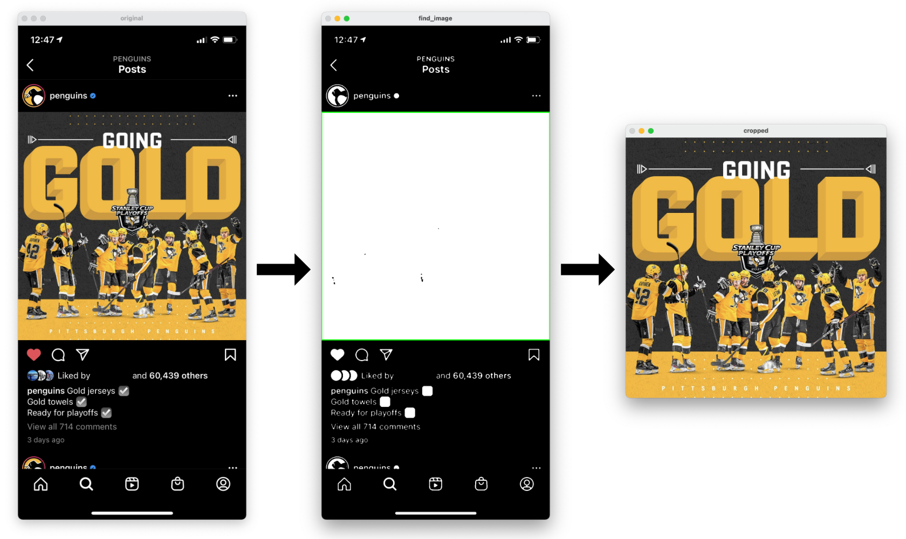

# Image Detector

Scratch library for messing around with opencv. Primary use is to detect the edge of images within images (e.g. crop a meme in a screenshot).

## Example

## Getting Started

1. Install opencv: `brew install opencv`
2. Add some images to the `test_images` directory
3. Modify the image paths in `main()` of `main.cpp`
4. Run `make IN="test_images/nhl_pens.png"`.
    * The `IN` variable can be changed to whatever image you want to use.
5. Press `q` to close the windows
